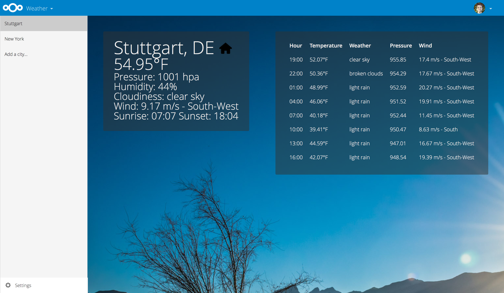

# Nextcloud Weather

**Nextcloud Weather provides an application to register cities and show the weather previsions**

## Installation

In your Nextcloud, simply navigate to »Apps«, choose the category »Tools«, find the Weather app and enable it.
Then open the Weather app from the app menu.

## Maintainers

- [Loïc Blot](https://github.com/nerzhul)

If you’d like to join, just go through the [issue list](https://github.com/nextcloud/weather/issues/) and fix some. :)

## Requirements

- Nextcloud 9+

## Support

If you need assistance or want to ask a question about Weather, you are welcome to [ask for support](https://help.nextcloud.com) in our Forums or the [IRC-Channel](https://webchat.freenode.net/?channels=nextcloud). If you have found a bug, feel free to open a new Issue on GitHub.
